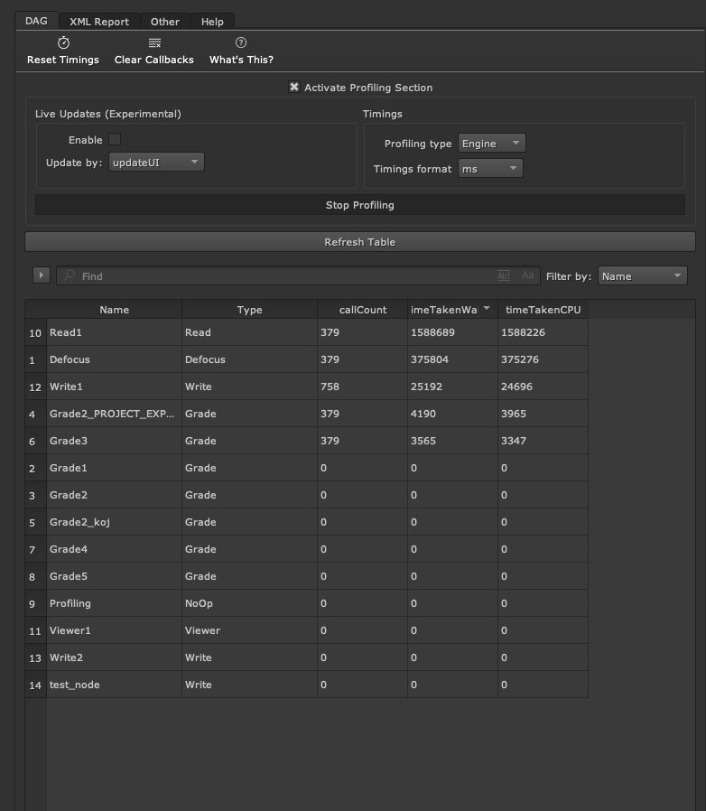
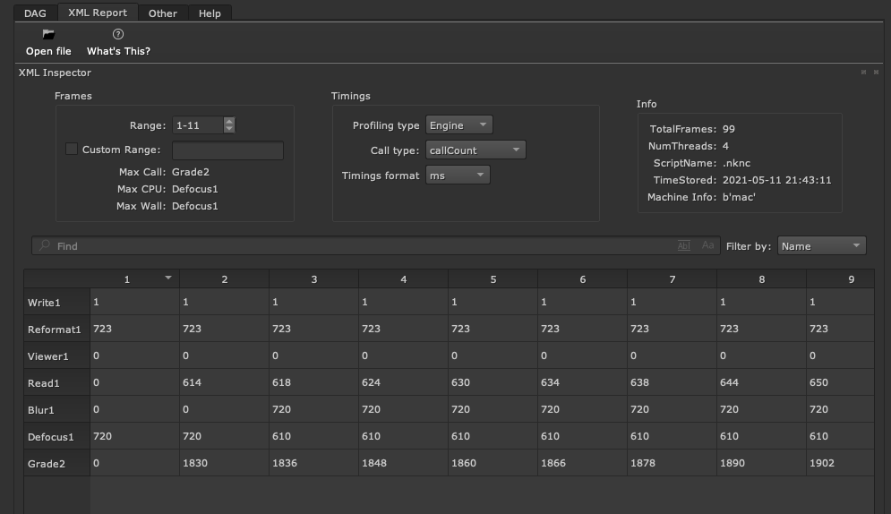
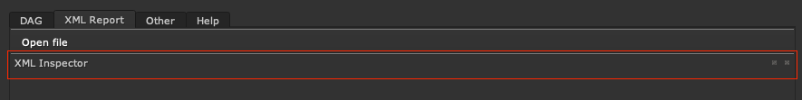

# 1. Profile Inspector

A Nuke plugin that helps to visualize the application profiling information in a more convenient and user friendly manner.

- [1. Profile Inspector](#1-profile-inspector)
  - [1.1. Important Note](#11-important-note)
  - [1.2. Installation](#12-installation)
  - [1.3. Usage](#13-usage)
  - [1.4. Overview](#14-overview)
    - [1.4.1. Dag Inspector](#141-dag-inspector)
    - [1.4.2. XML Inspector](#142-xml-inspector)
    - [1.4.3. Nuke Launcher](#143-nuke-launcher)
  - [1.5. Extras](#15-extras)
    - [1.5.1. Live Update](#151-live-update)
    - [1.5.2. Dock Windows](#152-dock-windows)
    - [1.5.3. Compatibility](#153-compatibility)

---

## 1.1. Important Note

The plugin is still in the stage of development so code is not yet documented as things could change or be moved/removed. Also readme is work in progress.

---

## 1.2. Installation

Save the plugin in your _.nuke_ directory or in a custom directory and then `import ProfileInspector` in your _menu.py_.  
**Remember**: If you use a custom plugin path, add the path in your init.py: `nuke.pluginAddPath('custom/path')`.
> N.B. if your downloaded  zip folder has a different name(ProfileInspector-master, ProfileInspector-0.0.2 etc.), then you need to rename it to just ProfileInspector.

## 1.3. Usage

The plugin does not introduce new workflows in terms of how to use the Nuke profiling options, but to summarize:

Dag Inspector

- At first launch, table might be empty, so it needs to be refreshed by clicking the Refresh Table button to read all the comp nodes.
- By clicking on **Activate Profile Section**, the plugin will also do a check for current node timers, but will likely be at 0 if the profiling hasn't been run before.
- Start the profiling wih the Start Profiling button.
- When the profiling is on, you can update the timers with the shortcut `U` that will trigger the image te bo recalculated.
- At this point you can refresh the table again and save a snapshot of the current timings. (timings will be saved in the table even if you stop the profiling listener).
- Find the node you want and tweak it (with or without [Live update](#172-live-update)).
- Refresh the table (save snapshot) and repeat.

XML Inspector

- Load a xml file created with Nuke.
- Use the table to find a specific node or a specific frame range.

## 1.4. Overview

> Each page offers a _What's This?_ option. This will show some additional information on certain sections.

Profile Inspector offers mainly 2 modes:

- The [Dag Inspector](#dag-inspector) where you can inspect the Nuke's Node Graph nodes
- The [XML Inspector](#xml-inspector) where you can inspect the XML report file that nuke generates.

It also offers a convenient way ([Nuke Launcher](#nuke-launcher)) to launch a Nuke instance with the profiling listener activated so to generate the xml report file.

### 1.4.1. Dag Inspector

The dag inspector offers a table view for current dag nodes. When the profiling is activated, the table shows each node profiling timers: _callCount_, _timeTakenCpu_, _timeTakenWall_.

Some of the features are:

- Quickly filter current nodes using regex with live feedback of results.
- Quickly zoom the node you are searching and open its properties panel.
- Sort columns and identify the heaviest/lightest node.
- Quickly change profiling information type: _Engine_, _Requests_, _Store_, _Validate_.
- Convert profiling timings to more human readable numbers.
- Take a snapshot of the current timings.
- [Live update](#live-update) (Experimental): adjust node parameters and see the actual effective time cost for the current frame.

### 1.4.2. XML Inspector

This section offers the ability to import the file that Nuke generates when launched with the `-Pf` arguments.
Much like the DAG table, users can filter nodes, change the profiling timings, and so on.

The window can also be un-docked (see [dock windows](#dock-windows) for more info).

### 1.4.3. Nuke Launcher

This section offers a convenient way to launch a new Nuke instance with the profiler listener activated.
This will be the equivalent of launching Nuke via terminal with the `nuke.exec -Pf file.xml project.nk` arguments.

Options available:

- Specify the Nuke executable to use (by default will use the one currently running the instance)
- Specify the Nuke composition to inspect.
- Specify the mode in which to launch Nuke (NukeX, NukeStudio, etc.)
- Capture Nuke's new instance output in a dockable window. (see [dock windows](#dock-windows) for more info).
- Add optional arguments to the execution.

## 1.5. Extras

### 1.5.1. Live Update

This option is labeled _experimental_ because I am not entirely sure about its use cases.

Based on my experience with other softwares, when I work on a single frame, I use the profiling to understand how "heavy" the something is with the current parameters settings.

But Nuke doesn't really work in that way and it keeps accumulating the timings even if the settings are turn to 0, i.e., just by moving the knob parameters up and down, the timers will increment regardless if you are using 100% or 1% of a specific parameter.

So the idea behind the live update is that; at each node parameter parameter change, a callback will be triggered (via either `updateUI` or `knobChanged`) and the profiling timers will reset. This will (likely) give you a representation of what the node is actually "consuming" with the current parameters settings.

This can be used on a frame by frame basis to manually adjust the node knob parameters to adjust performance.

Again, this section needs more tests and understanding so please let me know if you have some insights.

### 1.5.2. Dock Windows

> This feature is a leftover of a prototype and will probably be removed in future updates.

Much like the floating panel in nuke, certain windows can be un docked for convenience.

To dock/un-dock simply double click on the window titlebar, drag the window or use the apposite buttons.

### 1.5.3. Compatibility

Nuke version: 11,12, 13.

> Because Nuke 11 uses an early version of PySide2, future compatibility is not a guarantee.

While it should work the same on all platforms, it has been currently only tested on:

- Linux:
  - Ubuntu 21.04
  - CentOS 8
- MacOS:
  - Mojave 10.14.06
  - Catalina 10.15.06
- Windows 10
