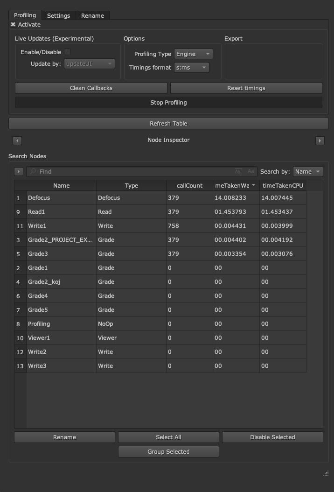
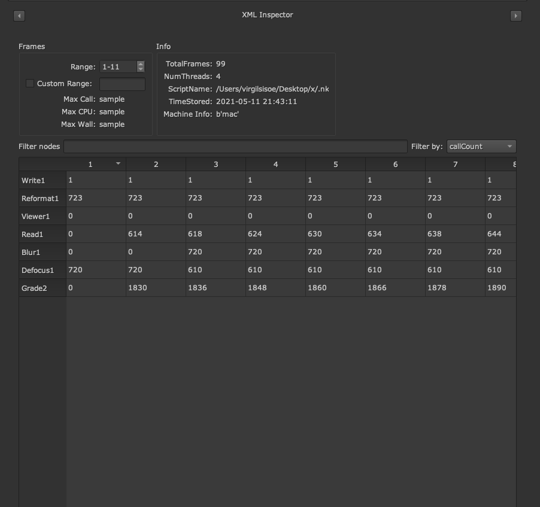
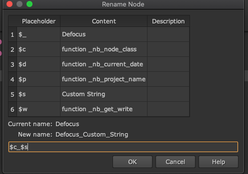

# ProfileInspector

## NOTE

Application is still in early stage of development and no documentation is provided.
Things could change in the future and major refractor is needed. Some section are present but do not yet work.
Currently works on Nuke11, 12, 13 with the main target platform being Nuke 12. Because Nuke11 uses an early version of PySide2, future compatibility is not a priority.

---

A Nuke plugin that offers some improvements reading the profile data and more.

Plugin is a table view app and offers various functionally of which some of them are:
- User friendly profiling analyzer
- User defined custom rename functionality.
- User defined custom buttons.
- Standalone version of the app that works outside Nuke (useful if analyzing a lot of frames with the XML inspector and screen real estate is necessary). Binary are not yet provided but user could build the app if PySide2 package is installed. Because the standalone version uses a custom nuke module, some limitation are to be considered.

## Installation

Copy ProfileInspector inside _.nuke_ folder and in your `menu.py` and import it: `import ProfileInspector`. The plugin should work on custom paths added by `nuke.pluginAddPath()` but it has not yet been tested.

## Usage

Once inside Nuke, plugin can be called from the custom panels option. More documentation will be provided at a later date.

## Profile analyzer

Some convenient features to read the profiling data of Nuke:

- Quickly and easily sort between nodes using regex with live feedback of results.
- Sort columns and identify the heaviest/lightest node.
- Quickly update profiling return type: Engine, Requests, Store, Validate.
- Live update (experimental): enables user to adjust node parameters and see the actual effective time cost for the current frame.
- Profiling snapshot: save the data so profiling listener could be closed.
- Human readable timings.
- Import of XML profiling reports. Section shows profiling data for all of the frames and offers various other features like: Filter nodes and custom range frame.
and more...

## Rename functionality

> this section could be extracted into a different project in the future

Plugin can also rename node/s based on user defined custom variables. This creates a dynamic renaming process based on the current node selected where user can filter nodes based on flags. Function documentation is parsed in order to extract the meta information about the variables so hopefully encouraging good coding practice!
Some example will be already avaliable inside _src/custom/user_variables.py_:

```python
def _nb_project_name():
    """Return project name of current session.

    :symbol: $p
    :description: project name
    :param: nuke node object

    """
    return nuke.root().name()


def _nb_only_write(node, nodeClass="Write"):
    """Return file path name.

    :symbol: $f
    :description: write node file path
    :param: nuke node object

    """
    return os.path.basename(node.toKnob('file').value())
```

This will create some variables (`$p`, `$f`) of which when called the will be replaced with their respective returns. `nb_only_write()` will currently work only for a write node because of the `nodeClass` flag.
User defined functions can have optional arguments in line with nuke standards:

- `node`: effectivley `nuke.thisNode()`
- `nodeClass`: optional flag that limits the function to specific nodes

## User defined buttons

> this section could be extracted into a different project in the future

This section is still in early stage but will give the user the ability to create custom buttons in line with Nuke User section expectation, where they will act on the selected nodes inside the table. Because the table is able to filter nodes with realtime feedback and with the use of regex, the user should be able to more quickly execute their actions on a group of nodes.

## Overview




